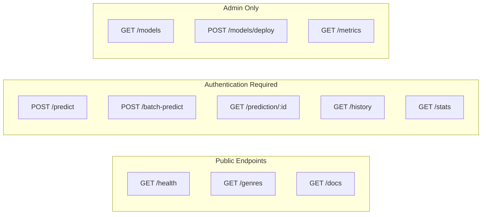
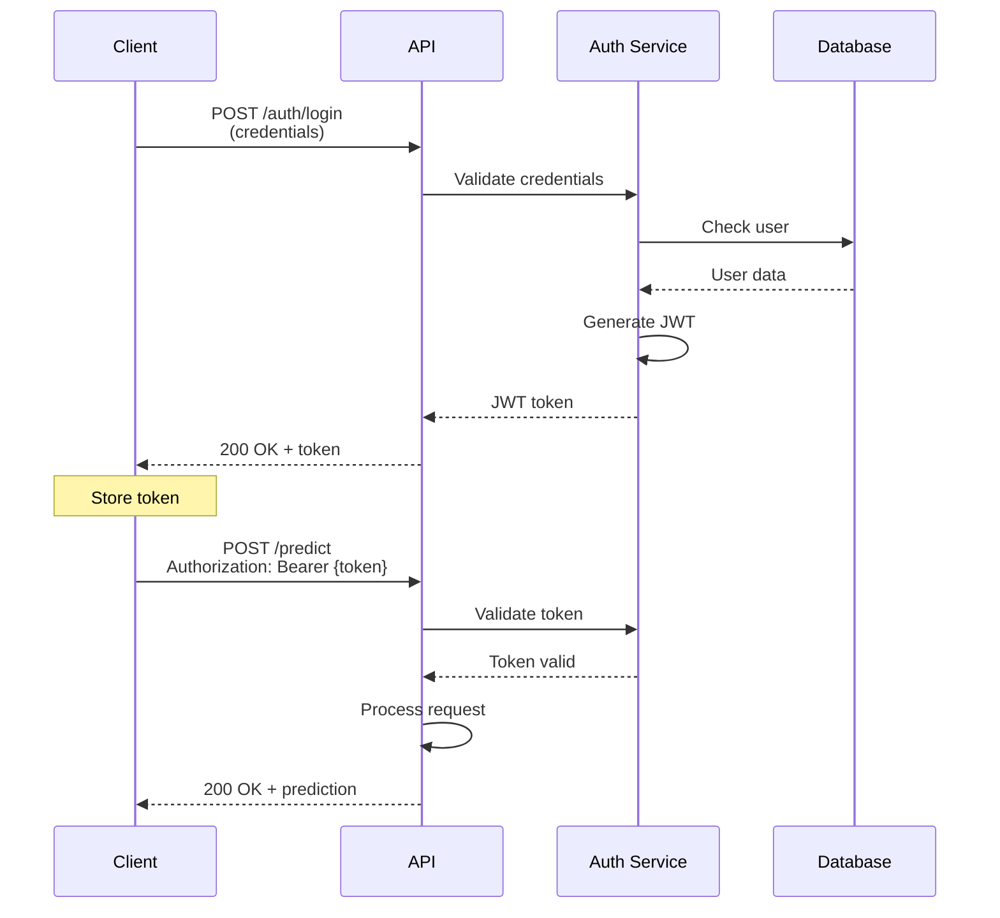
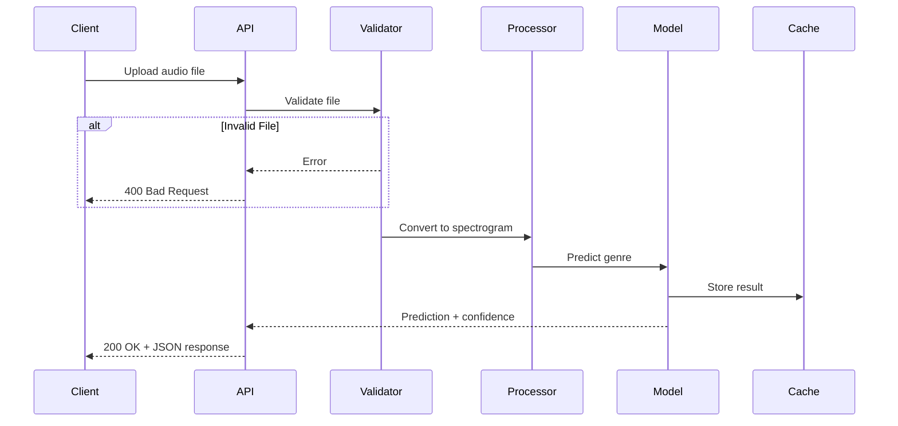
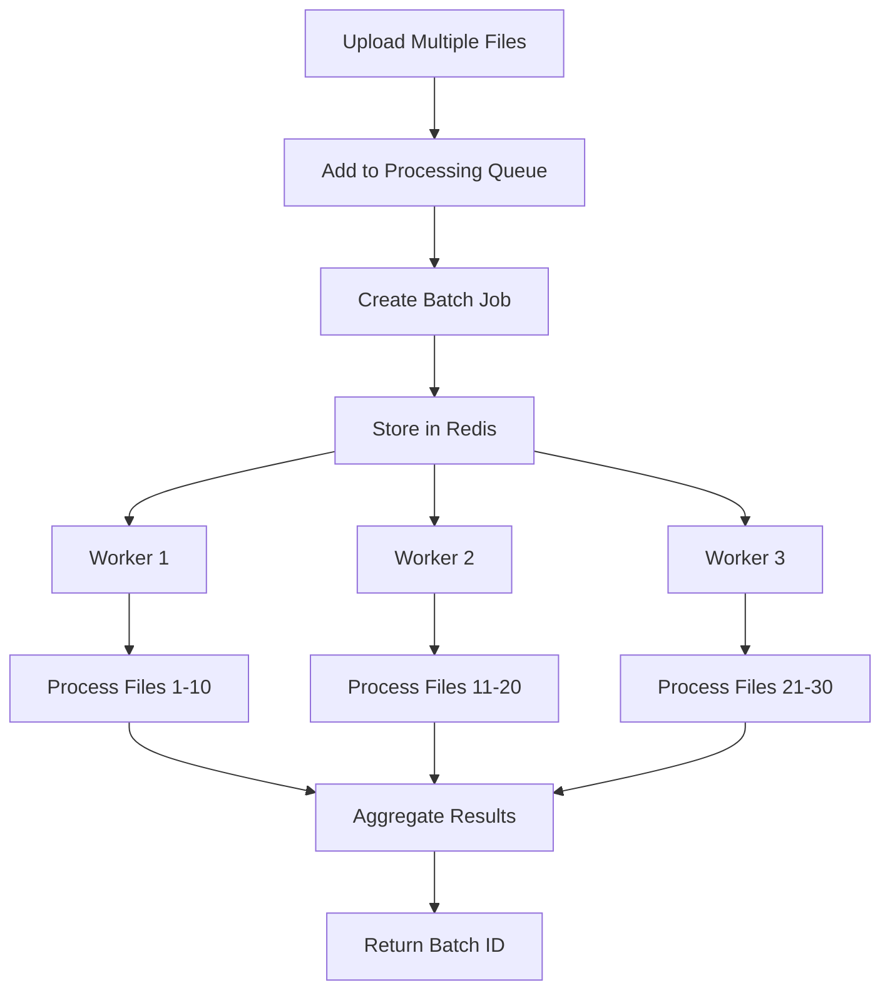
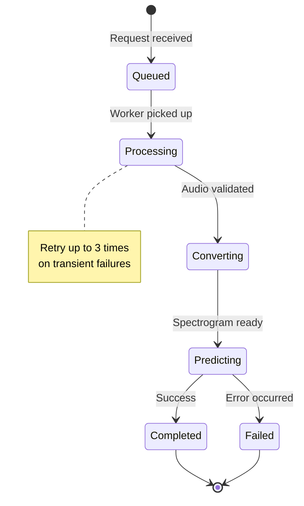
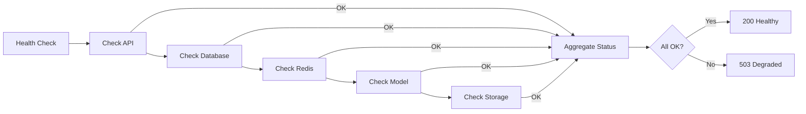
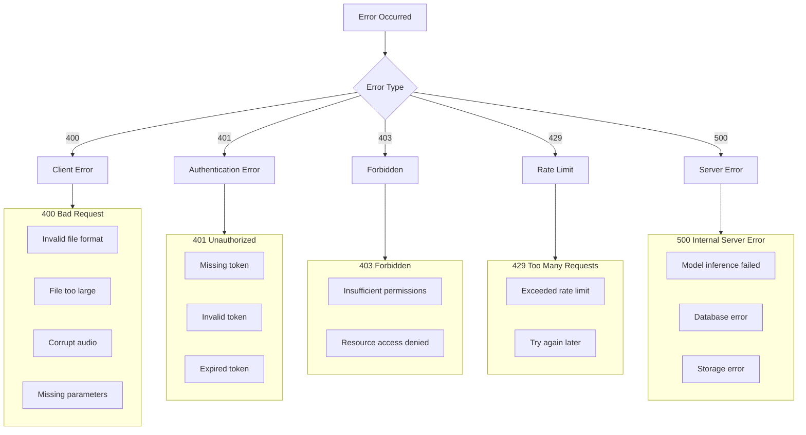
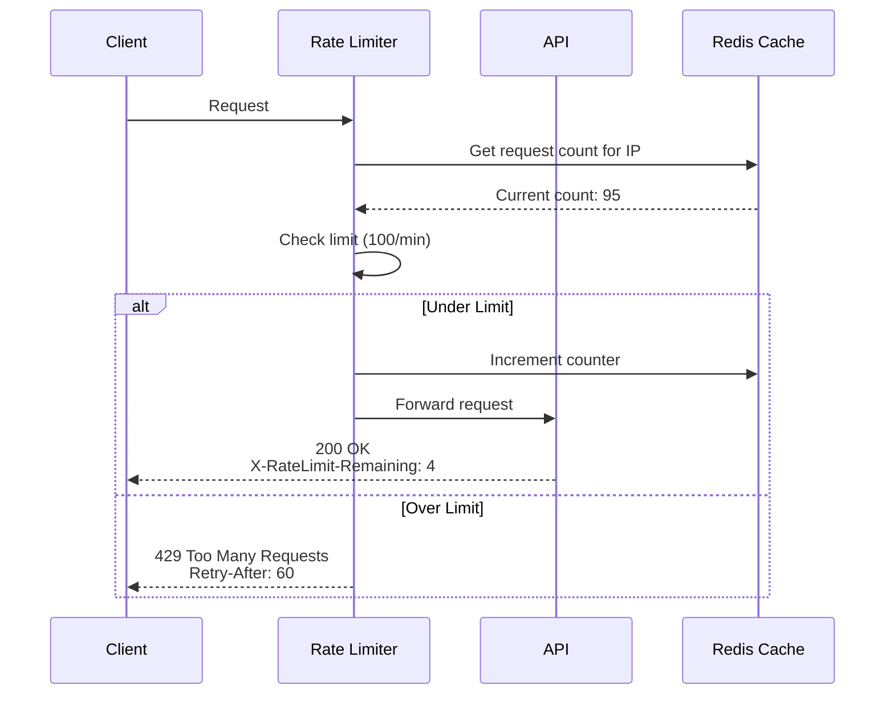
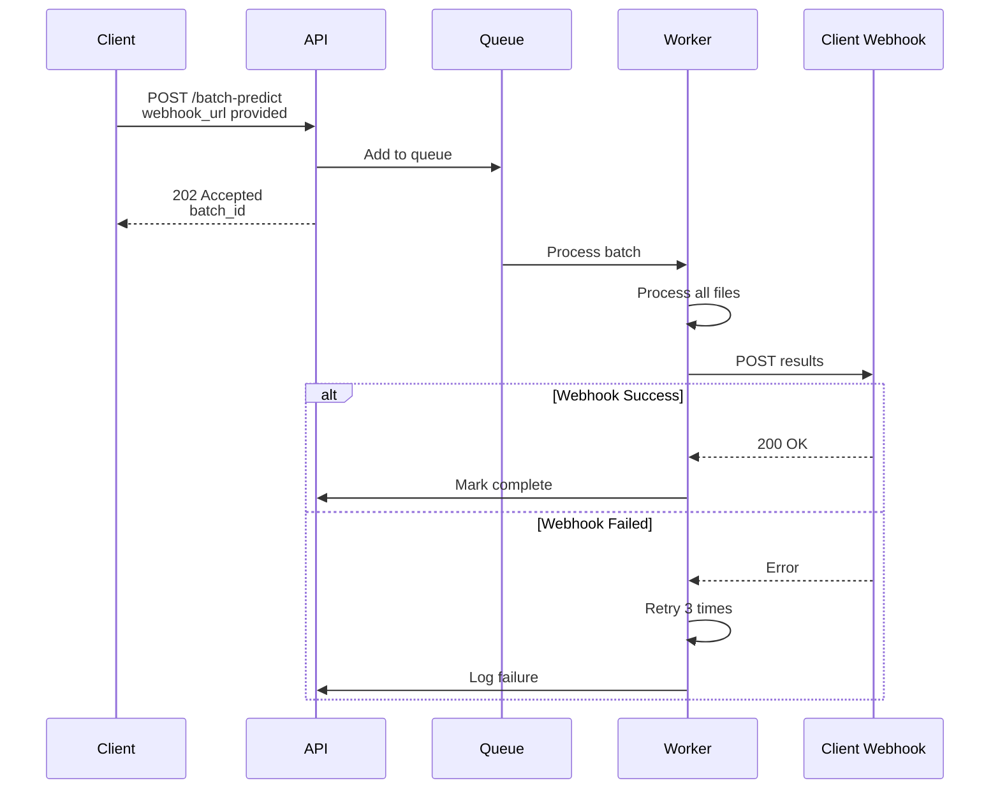
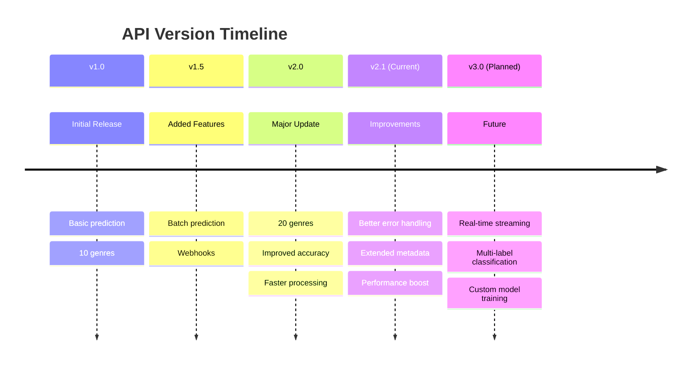

# API Documentation

## API Overview

RESTful API for music genre classification using audio file analysis and CNN-based prediction.

**Base URL**: `https://api.musicgenre.ai/v1`  
**Authentication**: JWT Bearer Token or API Key

---

## API Endpoints



---

## Authentication Flow



---

## Endpoint Specifications

### 1. Single File Prediction

**Endpoint**: `POST /api/v1/predict`

**Request**:
```http
POST /api/v1/predict HTTP/1.1
Host: api.musicgenre.ai
Authorization: Bearer {token}
Content-Type: multipart/form-data

file: [audio file]
```

**Response Flow**:


**Response Schema**:
```json
{
  "success": true,
  "data": {
    "prediction_id": "uuid-v4",
    "genre": "rock",
    "confidence": 0.89,
    "all_probabilities": {
      "rock": 0.89,
      "metal": 0.05,
      "blues": 0.03,
      "pop": 0.02,
      "jazz": 0.01
    },
    "processing_time_ms": 1234,
    "model_version": "v2.1.0",
    "spectrogram_url": "https://cdn.example.com/spectrograms/uuid.png"
  },
  "timestamp": "2025-12-01T19:20:00Z"
}
```

---

### 2. Batch Prediction

**Endpoint**: `POST /api/v1/batch-predict`

**Request**:
```http
POST /api/v1/batch-predict HTTP/1.1
Host: api.musicgenre.ai
Authorization: Bearer {token}
Content-Type: multipart/form-data

files[]: [audio file 1]
files[]: [audio file 2]
files[]: [audio file N]
```

**Processing Flow**:


**Response**:
```json
{
  "success": true,
  "data": {
    "batch_id": "batch-uuid",
    "status": "processing",
    "total_files": 25,
    "estimated_time_seconds": 180,
    "status_url": "/api/v1/batch/batch-uuid"
  }
}
```

---

### 3. Get Prediction Status

**Endpoint**: `GET /api/v1/prediction/:id`



**Response**:
```json
{
  "success": true,
  "data": {
    "prediction_id": "uuid",
    "status": "completed",
    "genre": "jazz",
    "confidence": 0.92,
    "created_at": "2025-12-01T19:15:00Z",
    "completed_at": "2025-12-01T19:15:03Z"
  }
}
```

---

### 4. Get Supported Genres

**Endpoint**: `GET /api/v1/genres`

**Response**:
```json
{
  "success": true,
  "data": {
    "genres": [
      {
        "id": "rock",
        "name": "Rock",
        "description": "Rock music genre",
        "sub_genres": ["classic-rock", "hard-rock", "alternative"]
      },
      {
        "id": "jazz",
        "name": "Jazz",
        "description": "Jazz music genre",
        "sub_genres": ["smooth-jazz", "bebop", "fusion"]
      }
    ],
    "total": 10
  }
}
```

---

### 5. Health Check

**Endpoint**: `GET /api/v1/health`



**Response**:
```json
{
  "status": "healthy",
  "version": "2.1.0",
  "components": {
    "api": "up",
    "database": "up",
    "redis": "up",
    "model": "up",
    "storage": "up"
  },
  "uptime_seconds": 86400,
  "timestamp": "2025-12-01T19:20:00Z"
}
```

---

## Error Handling



**Error Response Format**:
```json
{
  "success": false,
  "error": {
    "code": "INVALID_FILE_FORMAT",
    "message": "The uploaded file format is not supported",
    "details": "Supported formats: MP3, WAV",
    "timestamp": "2025-12-01T19:20:00Z",
    "request_id": "req-uuid"
  }
}
```

---

## Rate Limiting



**Rate Limits**:
- Free Tier: 100 requests/hour
- Basic Tier: 1,000 requests/hour
- Pro Tier: 10,000 requests/hour
- Enterprise: Custom

**Response Headers**:
```
X-RateLimit-Limit: 1000
X-RateLimit-Remaining: 950
X-RateLimit-Reset: 1638360000
```

---

## Request/Response Examples

### Successful Prediction

```bash
curl -X POST "https://api.musicgenre.ai/v1/predict" \
  -H "Authorization: Bearer YOUR_JWT_TOKEN" \
  -F "file=@song.mp3"
```

### Response

```json
{
  "success": true,
  "data": {
    "prediction_id": "pred-123abc",
    "genre": "electronic",
    "confidence": 0.94,
    "all_probabilities": {
      "electronic": 0.94,
      "pop": 0.03,
      "rock": 0.02,
      "jazz": 0.01
    },
    "processing_time_ms": 987,
    "model_version": "v2.1.0"
  },
  "timestamp": "2025-12-01T19:20:00Z"
}
```

---

## Webhook Support



**Webhook Payload**:
```json
{
  "event": "batch.completed",
  "batch_id": "batch-uuid",
  "status": "completed",
  "results": [
    {
      "file": "song1.mp3",
      "genre": "rock",
      "confidence": 0.89
    }
  ],
  "completed_at": "2025-12-01T19:25:00Z"
}
```

---

## SDK Examples

### Python SDK

```python
from musicgenre import MusicGenreClient

client = MusicGenreClient(api_key="your-api-key")

# Single prediction
result = client.predict("path/to/song.mp3")
print(f"Genre: {result.genre}, Confidence: {result.confidence}")

# Batch prediction
batch = client.batch_predict(["song1.mp3", "song2.mp3"])
print(f"Batch ID: {batch.id}")

# Check status
status = client.get_status(batch.id)
print(f"Status: {status.status}")
```

### JavaScript SDK

```javascript
import { MusicGenreClient } from '@musicgenre/sdk';

const client = new MusicGenreClient({ apiKey: 'your-api-key' });

// Single prediction
const result = await client.predict('path/to/song.mp3');
console.log(`Genre: ${result.genre}, Confidence: ${result.confidence}`);

// Batch prediction with webhook
const batch = await client.batchPredict(
  ['song1.mp3', 'song2.mp3'],
  { webhookUrl: 'https://your-app.com/webhook' }
);
```

---

## API Versioning Strategy



