# Music Genre Classifier - System Architecture

## Overview

A production-ready music genre classification system that converts audio files (MP3/WAV) into spectrograms and uses a Convolutional Neural Network (CNN) to classify them into genres (rock, jazz, classical, etc.).

---

## System Architecture

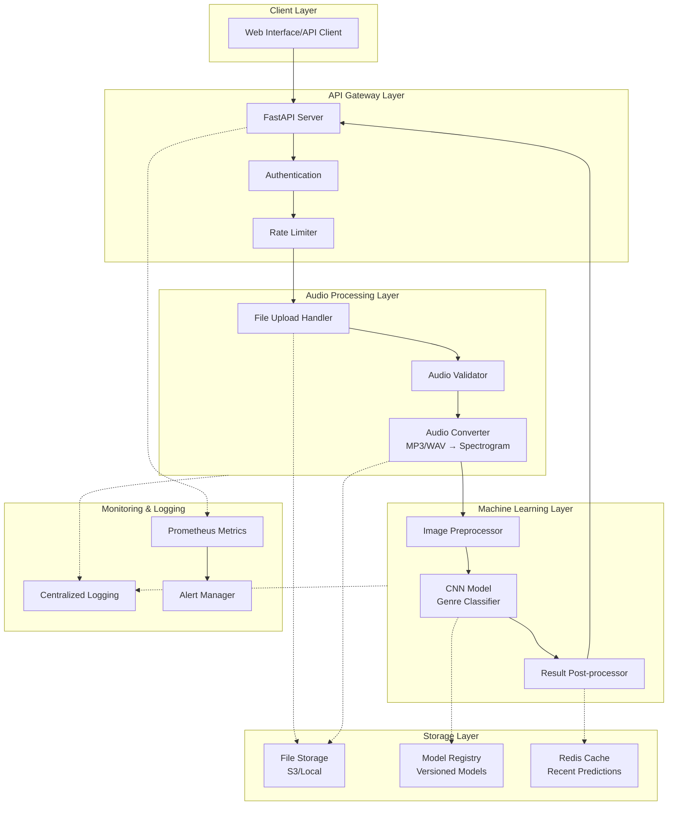

---

## Data Flow Pipeline

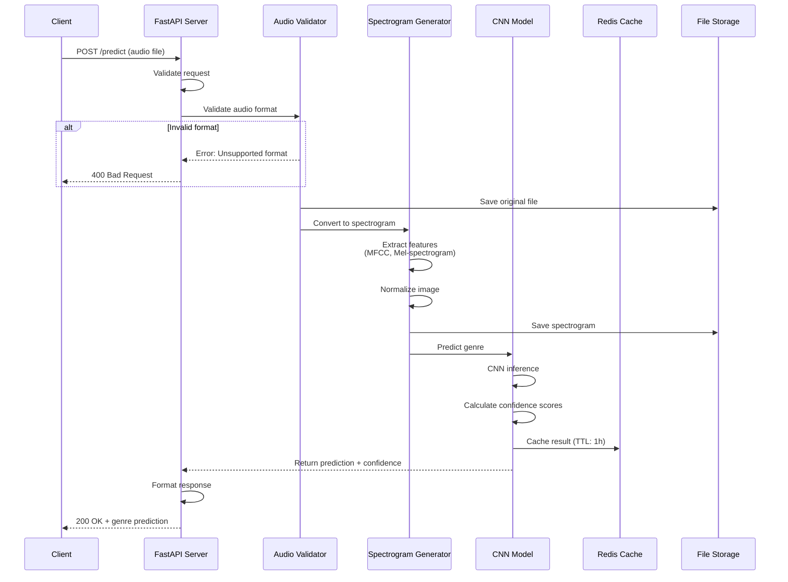

---

## CNN Model Architecture

```mermaid
graph LR
    subgraph Input["Input Layer"]
        Spec[Spectrogram Image<br/>128x128x3]
    end
    
    subgraph Conv1["Conv Block 1"]
        C1[Conv2D 32 filters<br/>3x3, ReLU]
        P1[MaxPooling 2x2]
        D1[Dropout 0.25]
    end
    
    subgraph Conv2["Conv Block 2"]
        C2[Conv2D 64 filters<br/>3x3, ReLU]
        P2[MaxPooling 2x2]
        D2[Dropout 0.25]
    end
    
    subgraph Conv3["Conv Block 3"]
        C3[Conv2D 128 filters<br/>3x3, ReLU]
        P3[MaxPooling 2x2]
        D3[Dropout 0.3]
    end
    
    subgraph Conv4["Conv Block 4"]
        C4[Conv2D 256 filters<br/>3x3, ReLU]
        P4[MaxPooling 2x2]
        D4[Dropout 0.3]
    end
    
    subgraph Dense["Fully Connected"]
        Flatten[Flatten]
        FC1[Dense 512<br/>ReLU]
        D5[Dropout 0.5]
        FC2[Dense 256<br/>ReLU]
        D6[Dropout 0.5]
    end
    
    subgraph Output["Output Layer"]
        Out[Dense N_genres<br/>Softmax]
    end
    
    Spec --> C1 --> P1 --> D1
    D1 --> C2 --> P2 --> D2
    D2 --> C3 --> P3 --> D3
    D3 --> C4 --> P4 --> D4
    D4 --> Flatten --> FC1 --> D5 --> FC2 --> D6 --> Out
```

---

## Audio Processing Pipeline

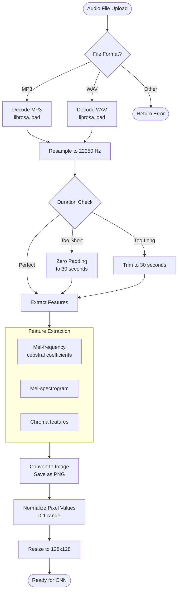

---

## Training Pipeline

```mermaid
flowchart LR
    subgraph Data["Data Preparation"]
        Raw[Raw Audio Files<br/>Labeled by Genre]
        Split[Train/Val/Test Split<br/>70/15/15]
        Aug[Data Augmentation<br/>- Time Stretch<br/>- Pitch Shift<br/>- Add Noise]
    end
    
    subgraph Training["Model Training"]
        Init[Initialize Model]
        Train[Training Loop<br/>- Batch Size: 32<br/>- Epochs: 100<br/>- Optimizer: Adam]
        Val[Validation]
        Early[Early Stopping<br/>Patience: 10]
        Save[Save Best Model]
    end
    
    subgraph Eval["Evaluation"]
        Test[Test Set Evaluation]
        Metrics[Calculate Metrics<br/>- Accuracy<br/>- F1 Score<br/>- Confusion Matrix]
        Report[Generate Report]
    end
    
    Raw --> Split
    Split --> Aug
    Aug --> Init
    Init --> Train
    Train --> Val
    Val --> Early
    Early -->|Continue| Train
    Early -->|Stop| Save
    Save --> Test
    Test --> Metrics
    Metrics --> Report
```

---

## Deployment Architecture

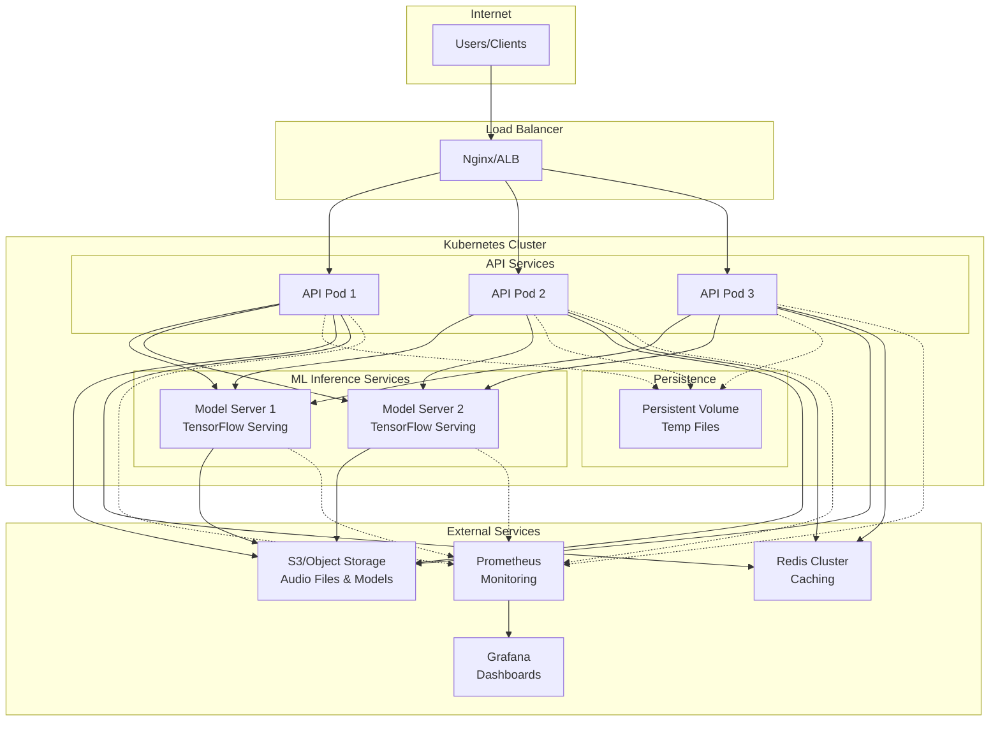

---

## API Design

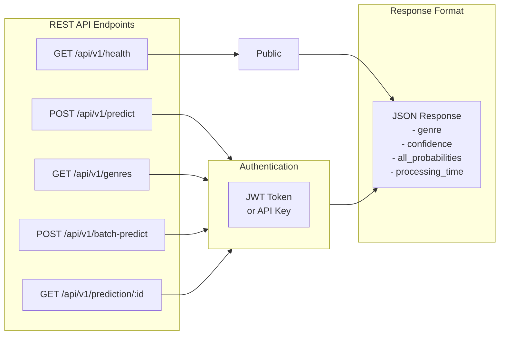

---

## Database Schema

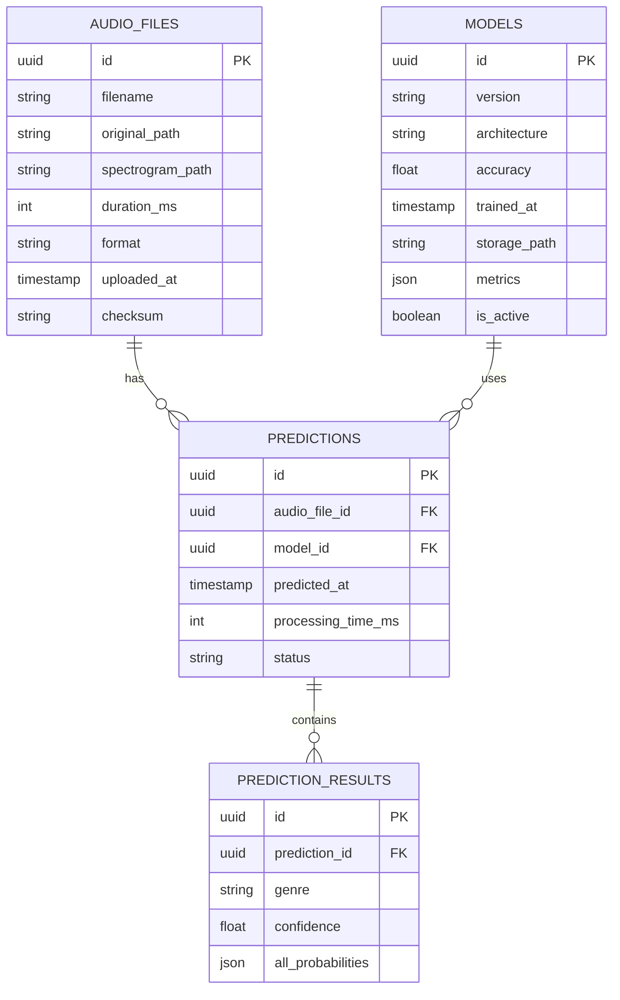

---

## Technology Stack

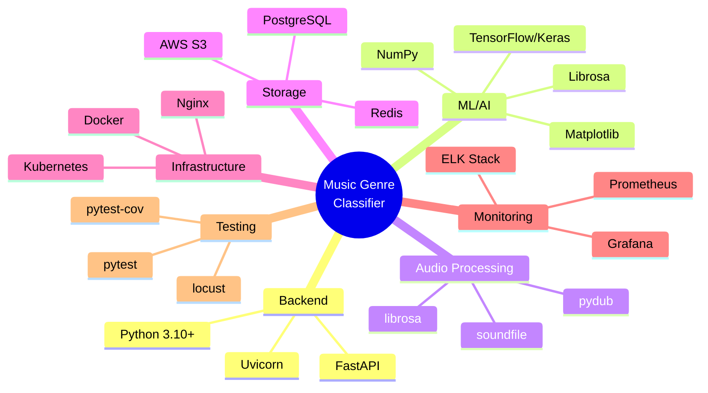

---

## Security Architecture

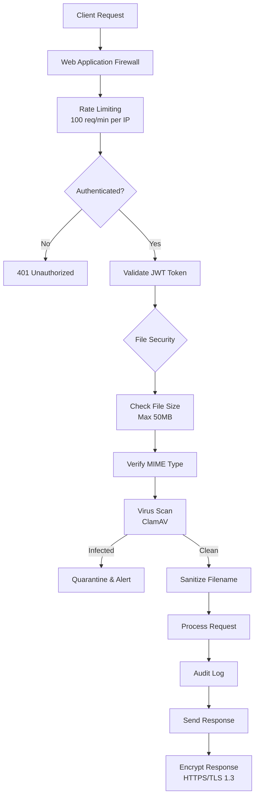

---

## Monitoring & Observability

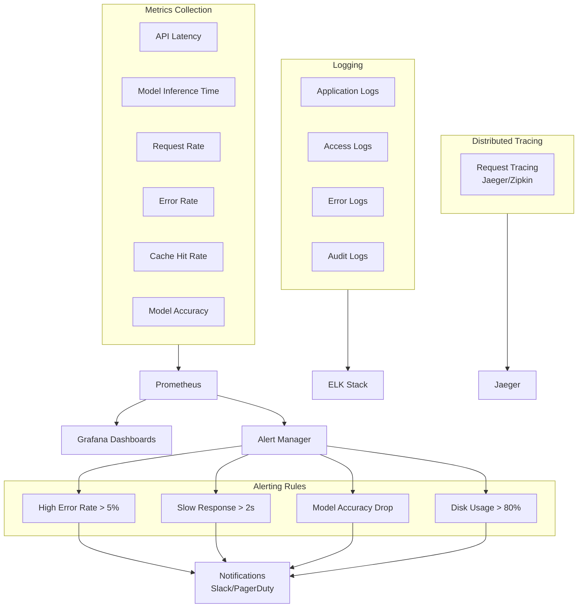

---

## CI/CD Pipeline

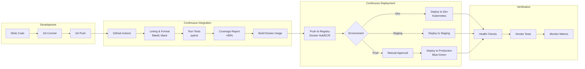

---

## Performance Optimization

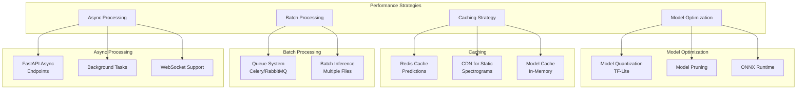

---

## Error Handling & Recovery

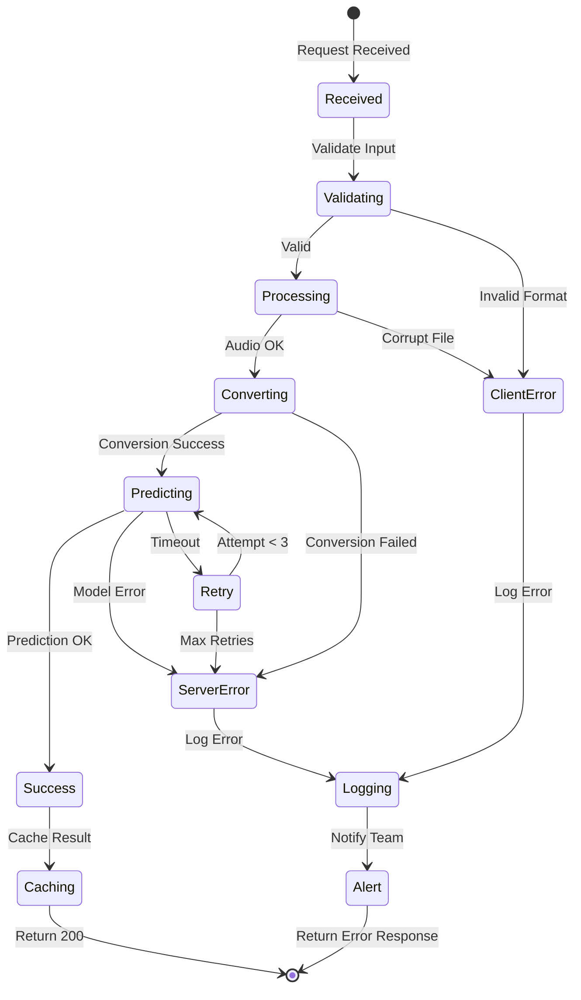

