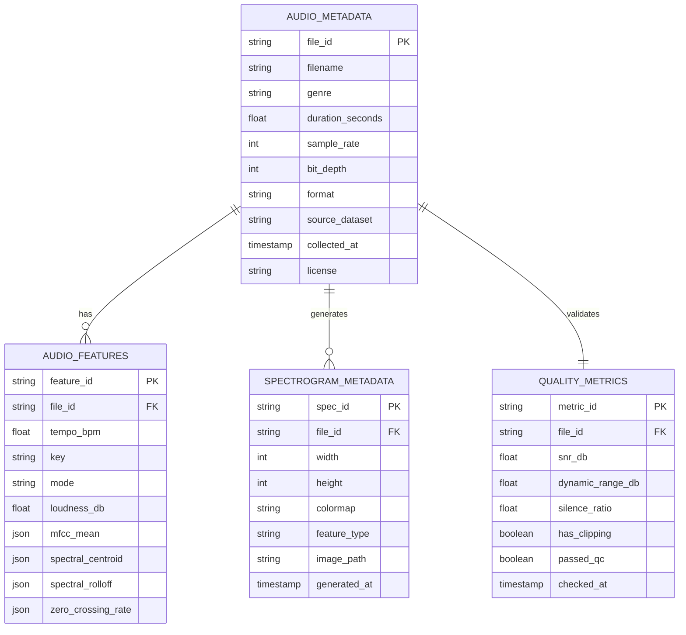

# Dataset Preparation Guide

## Supported Music Genres

---

## Dataset Structure

---

## Data Collection Strategy

---

## Data Preprocessing Pipeline

---

## Feature Extraction

---

## Data Augmentation Techniques

---

## Dataset Statistics & Distribution

---

## Data Quality Metrics

---

## Metadata Schema

---

## Data Version Control

---

## Dataset Maintenance Workflow

